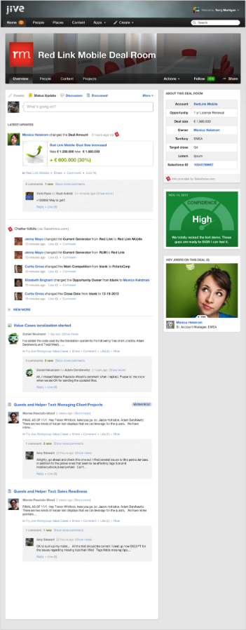

# Overview of Jive Purposeful Places

Jive has taken integration with a social platform to the next level. Now, for the first time, you can add more structure and meaning to ad-hoc collaboration by allowing each place in Jive, i.e. a group or space, to be created with a distinct "purpose". These specialized places create a more holistic view of a problem domain by easily aggregating Jive content, with information from other systems, including external activity streams. And the best part? It's all available via an API!
 
## Introducing Purposeful Places
Let's take a quick look at around. Below is a screen cap of the "Red Link Mobile Deal Room". Red Link Mobile is a fictional opportunity that our sales team is working to close. As in most fast paced sales cycles, the account reps need to bring in experts from across the company to for a variety of reasons. For example, Finance may be needed to help answer questions on the RFP, Engineering may need to prepare security documentation around the infrastructure, and Professional Services may need to tailor a work proposal that fits within the budget. In addition, much of the information about the opportunity will sit in other systems of record, e.g SalesForce. To close the deal faster, the account rep has created a "Deal Room" to collaborate across the company and pull all the content and information together in a well structured manner.
 
Below is an example of what a purposeful place targeted at opportunity management, a.k.a. a "Deal Room" might look like. On the left is an aggregated activity stream that contains information from Jive, SalesForce Chatter, and potentially other feeds as well. However, this isn't a dump of the entire Chatter feed. The information from Chatter that is in the Deal Room is only for the selected opportunity, Red Link Mobile.
 
## Tiles & Activity Stream Integration
On the right hand side is a new concept in Jive that we're calling "Tiles", e.g the "About the Deal Room", "Deal Confidence". You can think of a tile as three parts. First, there's the visual style. In the example below, there is a table, a gauge, and an image. Second, you a tile has data. The cool thing about tiles is that when they are configured, Jive creates a "Web hook" where you can asynchronously push data. When you push data into a tile's Web hook, Jive persists it, making page rendering fast. Lastly, tiles have actions. Similar to !App Experiences, you will be able to bring up a dialog box that enables the user to have a targeted interaction with a system of record. We can even do the OAuth dance to support three-legged OAuth!
 
On the left hand side is an activity stream integration. Notice that this includes not only the Jive activity stream, but content from third party applications as well, e.g. Salesforce Chatter. Any content can be integrated in this way as long as it conforms to a simplified version of the Activity Streams format. Adding a stream integration works very much like adding a Tile--you provide the data and Jive will give you a Web hook to push data into and take care of all the formatting for you.

